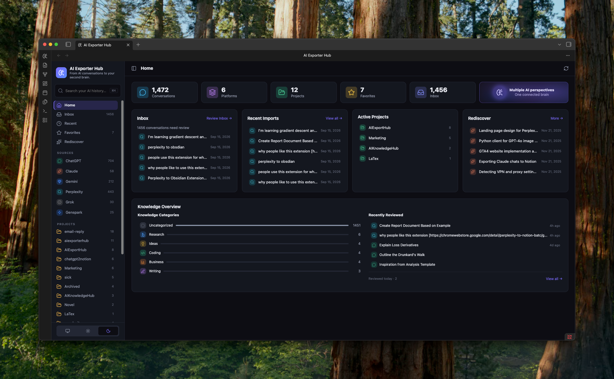
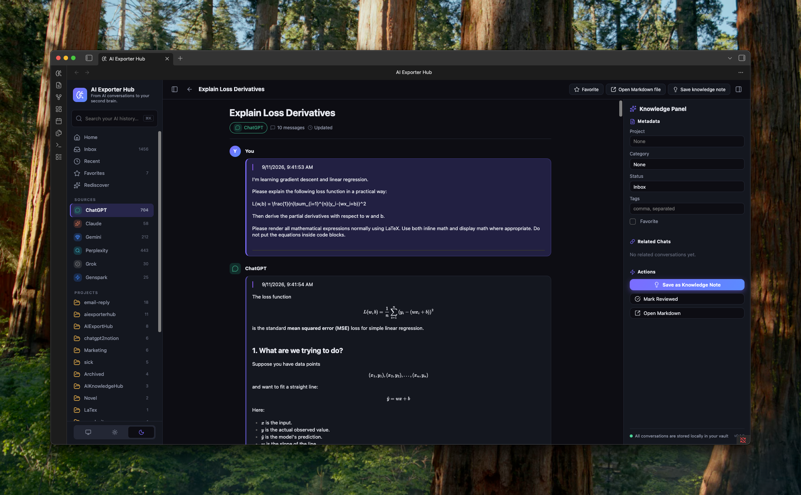

# AI Exporter Hub for Obsidian

将导出的 AI 对话整理成 Obsidian 中私密、可搜索的知识中心。

AI Exporter Hub 可以集中管理来自 ChatGPT、Claude、Gemini、Perplexity、Grok、Genspark 以及其他兼容 Markdown 导出工具的对话，同时确保数据始终保留在你的 Vault 中。

> 你的 Markdown 文件是唯一可信的数据源。

<p align="center">
  <a href="./README.md">English</a> · <strong>简体中文</strong> · <a href="./README.zh-TW.md">繁體中文</a> · <a href="./README.ja.md">日本語</a>
</p>

<p align="center">
  <a href="https://community.obsidian.md/plugins/ai-exporter-hub"><strong>在 Obsidian 社区插件目录中查看 AI Exporter Hub</strong></a>
</p>

## 为什么选择 AI Exporter Hub？

研究资料、代码、写作内容、决策记录和项目知识正分散在不同的 AI 服务中。AI Exporter Hub 将导出的对话汇集到一个本地资料库中，让这些内容在原始聊天结束后依然能够持续发挥价值。

本插件直接建立在普通 Markdown 文件之上，不依赖特定 AI 服务商、专有数据库、云端账户或 Dataview。

## 界面截图

### 首页仪表盘



### 对话阅读器与知识面板



## 功能

- 在一个仪表盘中浏览多个 AI 平台的对话。
- 按来源、项目、分类、标签、收藏状态和审阅状态整理对话。
- 在收件箱中审阅新对话，并快速查看最近导入的内容。
- 搜索标题、元数据、标签，并可选择搜索完整对话内容。
- 使用基于 Obsidian Markdown 渲染器的专用阅读器查看长对话。
- 通过 YAML frontmatter 更新项目、分类、状态、标签和收藏信息。
- 创建普通 Markdown 知识笔记，并链接回来源对话。
- 根据共同项目、分类和标签发现相关对话。
- 利用本地元数据重新发现较早收藏或已审阅的对话。
- 随时根据 Markdown 文件重建内存索引。

当前所有功能都不需要连接任何 AI 服务。

## Local-first 设计

AI Exporter Hub 将你的 Vault 视为数据库：

- 无需账户。
- 不收集遥测或分析数据。
- 不上传对话内容。
- 不使用后台网络服务。
- 不引入专有存储格式。
- 卸载插件不会删除或修改你的笔记。
- 插件不会读取剪贴板；只有在你点击 **Copy** 时才会写入对应的消息文本。

插件仅在内存中保存可以随时重建的搜索索引。当你修改整理字段时，插件会通过 Obsidian 文件 API 将内容写入笔记的 YAML frontmatter。

可选的 **Open original** 操作只会在你主动点击后打开笔记中的 `source_url`，并且仅接受 HTTP 和 HTTPS 链接。与 Obsidian 普通阅读视图一致，当笔记引用远程资源时，渲染 Markdown 可能会加载这些资源。

## 支持的对话格式

推荐在 YAML frontmatter 中使用 `type: ai-conversation`：

```yaml
---
type: ai-conversation
schema_version: 1
title: "Product research notes"
platform: ChatGPT
conversation_id: abc123
source_url: https://chatgpt.com/c/abc123
created_at: 2026-09-01T10:00:00Z
updated_at: 2026-09-01T11:00:00Z
exported_at: 2026-09-01T11:05:00Z
project: Product Development
category: Research
tags:
  - product
  - ai-research
favorite: false
status: inbox
message_count: 24
word_count: 6200
---
```

最小可用文件可以只有：

```yaml
---
type: ai-conversation
title: Example conversation
platform: Claude
---
```

文件其余部分仍然是标准 Markdown。使用 `## User` 和 `## Assistant` 等标题可以获得最佳阅读体验，但这些标题不是必需的。

AI Exporter Hub 也能识别旧版导出文件：frontmatter 中需要同时包含受支持的平台信息，以及来源 URL、日期、对话 ID 或消息数量等对话元数据。

### 可识别的平台

- ChatGPT
- Claude
- Gemini
- Perplexity
- Grok
- Genspark
- 其他兼容的 Markdown 导出内容

本插件不会直接从 AI 网站抓取或下载对话。你可以自己创建兼容文件、从其他工具导入，或者使用可选的对话导出工具。

## 安装

### Obsidian 社区插件

AI Exporter Hub 已在 [Obsidian 社区插件目录](https://community.obsidian.md/plugins/ai-exporter-hub)上架：

1. 在 Obsidian 中打开 **设置 → 第三方插件**。
2. 选择 **浏览**。
3. 搜索 **AI Exporter Hub**。
4. 安装并启用插件。

### BRAT

在进入官方目录之前，可通过 BRAT 参与测试：

1. 安装 [BRAT](https://obsidian.md/plugins?id=obsidian42-brat)。
2. 在 BRAT 设置中选择 **Add beta plugin**。
3. 输入 `https://github.com/joysey/ai-exporter-hub-obsidian`。
4. 在 Obsidian 中启用 **AI Exporter Hub**。

通过 BRAT 安装前，GitHub 仓库必须已有包含插件文件的正式 Release。

### 手动安装

从最新 GitHub Release 下载 `main.js`、`manifest.json` 和 `styles.css`，将它们放入：

```text
<vault>/.obsidian/plugins/ai-exporter-hub/
```

重启 Obsidian，然后在 **设置 → 第三方插件** 中启用 **AI Exporter Hub**。

### 从源码构建

```bash
git clone https://github.com/joysey/ai-exporter-hub-obsidian.git
cd ai-exporter-hub-obsidian
npm install
npm run build
```

将生成的 `main.js` 与 `manifest.json`、`styles.css` 一起复制到上面的插件目录。

## 开始使用

1. 从 Obsidian 左侧功能区或命令面板打开 **AI Exporter Hub**。
2. 选择包含 AI 对话 Markdown 文件的 Vault 文件夹。
3. 选择 **Scan folder**。
4. 使用仪表盘、收件箱、来源、项目和分类视图浏览对话库。
5. 打开对话后，可以阅读内容、编辑元数据或保存关联的知识笔记。

默认文件夹为：

```text
AI Knowledge/             # 对话资料库
AI Knowledge/Knowledge/   # 生成的知识笔记
```

这两个文件夹都可以在插件设置中修改。

## 命令

以下名称与插件当前的英文命令保持一致：

- `Open hub`
- `Open inbox`
- `Search AI conversations`
- `Rebuild conversation index`
- `Mark current conversation as reviewed`
- `Save current conversation as favorite`

## 兼容性

- 需要 Obsidian 1.7.2 或更高版本。
- 运行时只使用标准 Obsidian API 和浏览器 API，不使用 Node.js 或 Electron API。
- 本版本仅支持桌面端，暂不支持移动端布局。
- 不依赖 Dataview、特定主题或外部账户。

## 性能

启动索引仅限于配置的对话文件夹，并只读取 Obsidian 元数据缓存中的 frontmatter，不会加载每个对话的正文。全文索引为可选功能，会分批延迟构建，并提供可配置的文件数量上限，因此在支持大型对话库的同时仍能保持初始仪表盘响应速度。

报告性能问题时，请提供大致对话数量、Obsidian 版本、操作系统和插件版本。除非确有必要并且可以安全公开，否则请勿附加私人对话内容。

## 可选的配套导出工具

AI Exporter Hub 可以处理任何兼容的 Markdown 文件。配套浏览器工具可以帮助你从受支持的 AI 服务中导出对话，但它们是可选工具，并非使用本插件的必要条件。

本插件自身不会销售其他产品，也不会要求购买或使用其他产品。

## 开发

开发环境需要 Node.js 20 或更高版本。

```bash
npm install
npm run dev       # 监听模式
npm run check     # lint、类型检查、测试和生产构建
```

生产构建会生成 `main.js`。自动化测试覆盖日期与元数据规范化、对话解析、筛选、相关内容和搜索辅助逻辑。

## 参与贡献

欢迎提交问题和 Pull Request。规划较大的修改前，请先阅读 [CONTRIBUTING.md](./CONTRIBUTING.md)。

提交问题时，请从截图、日志和示例文件中移除私人对话、Vault 路径及其他敏感数据。

## 路线图

未来可能增加批量元数据编辑、更强的重新发现信号、可选摘要与洞察、语义搜索以及跨对话工作流。如果未来加入需要向外部服务发送内容的功能，该功能将默认关闭，并会在发布前明确说明。

## 许可证

[MIT](./LICENSE) © 2026 AIExportHub

## 免责声明

AI Exporter Hub 是独立的社区项目，与 Obsidian、OpenAI、Anthropic、Google、Perplexity、xAI 或 Genspark 没有关联，也未获得这些组织的官方认可。
